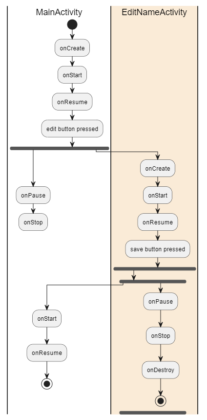
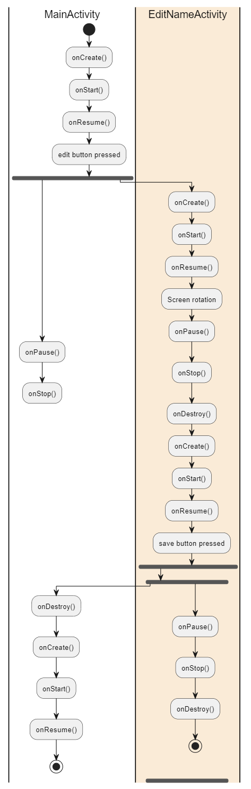

# Rapport - Développement Android Laboratoire n°2

## Auteurs

    - Ouweis Harun, Amir Mouti

## Mise en œuvre de la solution

NB : Pour modifier la page de démarrage d'activité il faut modifier le fichier `AndroidManifest.xml` et changer la valeur de l'attribut `android:name` de la balise `<activity>`.

### 1. Que se passe-t-il si l’utilisateur appuie sur « back » lorsqu’il se trouve sur la seconde Activité ?

Lorsque l'utilisateur appuie sur le bouton "Back" dans la seconde activité (**EditNameActivity**), la modification du prénom n'est pas sauvegardée, car la méthode `setResult()` n'est pas appelée. Cela signifie que l'activité retourne simplement au précédent état sans transmettre de données à la première activité (**WelcomeActivity**). **WelcomeActivity** restera donc avec le prénom précédemment affiché (ou l'absence de prénom si aucune saisie n'a été effectuée auparavant).

### 2. Diagramme des changements d’état des deux Activités

#### a. L’utilisateur ouvre l’application, clique sur le bouton éditer, renseigne son prénom et sauve

voici les logs enregistrés dans la console :

```log
---------------------------- PROCESS STARTED (8463) for package ch.heigvd.iict.daa.basictemplate ----------------------------
2024-10-08 16:40:02.341  8463-8463  WelcomeActivity         ch.heigvd.iict.daa.basictemplate     D  onCreate called
2024-10-08 16:40:02.561  8463-8463  WelcomeActivity         ch.heigvd.iict.daa.basictemplate     D  onStart called
2024-10-08 16:40:02.572  8463-8463  WelcomeActivity         ch.heigvd.iict.daa.basictemplate     D  onResume called
2024-10-08 16:40:25.593  8463-8463  WelcomeActivity         ch.heigvd.iict.daa.basictemplate     D  onPause called
2024-10-08 16:40:25.858  8463-8463  EditNameActivity        ch.heigvd.iict.daa.basictemplate     D  onCreate called
2024-10-08 16:40:25.864  8463-8463  EditNameActivity        ch.heigvd.iict.daa.basictemplate     D  onStart called
2024-10-08 16:40:25.869  8463-8463  EditNameActivity        ch.heigvd.iict.daa.basictemplate     D  onResume called
2024-10-08 16:40:26.861  8463-8463  VRI[WelcomeActivity]    ch.heigvd.iict.daa.basictemplate     D  visibilityChanged oldVisibility=true newVisibility=false
2024-10-08 16:40:26.890  8463-8463  WelcomeActivity         ch.heigvd.iict.daa.basictemplate     D  onStop called
2024-10-08 16:40:32.281  8463-8463  EditNameActivity        ch.heigvd.iict.daa.basictemplate     D  onPause called
2024-10-08 16:40:32.312  8463-8463  WelcomeActivity         ch.heigvd.iict.daa.basictemplate     D  onStart called
2024-10-08 16:40:32.344  8463-8463  WelcomeActivity         ch.heigvd.iict.daa.basictemplate     D  onResume called
2024-10-08 16:40:33.209  8463-8463  VRI[EditNameActivity]   ch.heigvd.iict.daa.basictemplate     D  visibilityChanged oldVisibility=true newVisibility=false
2024-10-08 16:40:33.250  8463-8463  EditNameActivity        ch.heigvd.iict.daa.basictemplate     D  onStop called
2024-10-08 16:40:33.257  8463-8463  EditNameActivity        ch.heigvd.iict.daa.basictemplate     D  onDestroy called
```

Diagramme d'état ici :



#### b. L’utilisateur ouvre l’application en mode portrait, clique sur le bouton éditer, bascule en mode paysage, renseigne son prénom et sauve

voici les logs enregistrés dans la console :

```log

---------------------------- PROCESS STARTED (8552) for package ch.heigvd.iict.daa.basictemplate ----------------------------
2024-10-08 16:42:08.227  8552-8552  WelcomeActivity         ch.heigvd.iict.daa.basictemplate     D  onCreate called
2024-10-08 16:42:08.361  8552-8552  WelcomeActivity         ch.heigvd.iict.daa.basictemplate     D  onStart called
2024-10-08 16:42:08.369  8552-8552  WelcomeActivity         ch.heigvd.iict.daa.basictemplate     D  onResume called
2024-10-08 16:42:15.191  8552-8552  WelcomeActivity         ch.heigvd.iict.daa.basictemplate     D  onPause called
2024-10-08 16:42:15.399  8552-8552  EditNameActivity        ch.heigvd.iict.daa.basictemplate     D  onCreate called
2024-10-08 16:42:15.404  8552-8552  EditNameActivity        ch.heigvd.iict.daa.basictemplate     D  onStart called
2024-10-08 16:42:15.409  8552-8552  EditNameActivity        ch.heigvd.iict.daa.basictemplate     D  onResume called
2024-10-08 16:42:16.372  8552-8552  VRI[WelcomeActivity]    ch.heigvd.iict.daa.basictemplate     D  visibilityChanged oldVisibility=true newVisibility=false
2024-10-08 16:42:16.398  8552-8552  WelcomeActivity         ch.heigvd.iict.daa.basictemplate     D  onStop called
2024-10-08 16:42:30.946  8552-8552  EditNameActivity        ch.heigvd.iict.daa.basictemplate     D  onPause called
2024-10-08 16:42:30.974  8552-8552  EditNameActivity        ch.heigvd.iict.daa.basictemplate     D  onStop called
2024-10-08 16:42:30.984  8552-8552  EditNameActivity        ch.heigvd.iict.daa.basictemplate     D  onDestroy called
2024-10-08 16:42:31.361  8552-8552  EditNameActivity        ch.heigvd.iict.daa.basictemplate     D  onCreate called
2024-10-08 16:42:31.379  8552-8552  EditNameActivity        ch.heigvd.iict.daa.basictemplate     D  onStart called
2024-10-08 16:42:31.412  8552-8552  EditNameActivity        ch.heigvd.iict.daa.basictemplate     D  onResume called
2024-10-08 16:42:44.353  8552-8552  EditNameActivity        ch.heigvd.iict.daa.basictemplate     D  onPause called
2024-10-08 16:42:44.379  8552-8552  WelcomeActivity         ch.heigvd.iict.daa.basictemplate     D  onDestroy called
2024-10-08 16:42:44.455  8552-8552  WelcomeActivity         ch.heigvd.iict.daa.basictemplate     D  onCreate called
2024-10-08 16:42:44.459  8552-8552  WelcomeActivity         ch.heigvd.iict.daa.basictemplate     D  onStart called
2024-10-08 16:42:44.469  8552-8552  WelcomeActivity         ch.heigvd.iict.daa.basictemplate     D  onResume called
2024-10-08 16:42:45.413  8552-8552  VRI[EditNameActivity]   ch.heigvd.iict.daa.basictemplate     D  visibilityChanged oldVisibility=true newVisibility=false
2024-10-08 16:42:45.447  8552-8552  EditNameActivity        ch.heigvd.iict.daa.basictemplate     D  onStop called
2024-10-08 16:42:45.454  8552-8552  EditNameActivity        ch.heigvd.iict.daa.basictemplate     D  onDestroy called


```

Diagramme d'état ici :



### 3. Que faut-il mettre en place pour que vos Activités supportent la rotation de l’écran ? Est-ce nécessaire de le réaliser pour les deux Activités, quelle est la différence ?

Lorsque l'appareil change d'orientation, le système Android détruit et recrée chaque activité pour appliquer la nouvelle configuration. Ce comportement peut entraîner la perte des données temporaires (comme le prénom saisi dans l'**EditText**). Pour éviter cela, il est nécessaire d'implémenter **onSaveInstanceState()** dans chaque activité pour sauvegarder les données avant la recréation de l'activité.

#### Solution pour **WelcomeActivity**

Dans **WelcomeActivity**, le prénom saisi ou modifié peut être sauvegardé dans **onSaveInstanceState()** et restauré dans **onRestoreInstanceState()** après la rotation de l'écran. Cela permet de maintenir le message de bienvenue à jour même après la rotation.

#### Solution pour **EditNameActivity**

Dans **EditNameActivity**, la valeur saisie dans le champ **EditText** peut également être sauvegardée dans **onSaveInstanceState()**. Cela permettra de restaurer le contenu du champ de texte après la rotation, évitant ainsi à l'utilisateur de devoir ressaisir son prénom.

### Différence entre les deux Activités face à la rotation

- Dans **WelcomeActivity**, il est essentiel de sauvegarder le prénom affiché afin de maintenir la continuité de l'expérience utilisateur.
- Dans **EditNameActivity**, si l'utilisateur a déjà commencé à entrer son prénom, il est crucial de sauvegarder cette information pour éviter de perdre les données saisies après une rotation de l'écran.

Le comportement indésirable dans **WelcomeActivity** survient lorsque l'utilisateur bascule l'écran après avoir reçu un nouveau prénom. Sans gestion spécifique de l'état, le prénom affiché pourrait revenir à une valeur précédente (ou être vide) après la rotation.

La différence principale est que **WelcomeActivity** est davantage liée à l'affichage des informations, tandis que **EditNameActivity** est plus centrée sur la saisie de données utilisateur. Dans les deux cas, il est important de sauvegarder et restaurer l'état pour éviter de perdre ces données lors de la rotation de l'écran.

### 4. Discussion sur la restauration de l'état des Fragments

#### a. Pourquoi la couleur est-elle restaurée même si on n’utilise pas `onSaveInstanceState()` dans ColorFragment ?

Le système Android gère automatiquement la sauvegarde et la restauration de l'état de certaines vues, telles que les **SeekBars** du **ColorFragment**. Cela est dû à l'API de sauvegarde automatique des **ViewStates**. En effet, chaque composant de l'interface utilisateur possède une capacité interne à sauvegarder son propre état à travers la rotation de l'écran, sans qu'il soit nécessaire d'implémenter explicitement `onSaveInstanceState()`.

Dans le cas de **ColorFragment**, les valeurs des **SeekBars** sont sauvegardées et restaurées automatiquement par Android. Cela fonctionne car le framework sauvegarde l'état des vues en utilisant leur identifiant unique (**id**), ce qui permet de restaurer l'état de la vue (comme la position du curseur) lorsque l'activité ou le fragment est recréé après une rotation d'écran.

En résumé, la restauration des couleurs dans **ColorFragment** est automatique grâce à la gestion interne des **ViewStates** par Android, qui ne nécessite pas d'implémentation explicite d'une méthode de sauvegarde d'état.

#### b. Que se passe-t-il si nous plaçons deux fois le CounterFragment dans l’Activité ? Comment se passe la restauration de l’état en cas de rotation de l’écran ?

Lorsque nous plaçons deux instances de **CounterFragment** dans la même activité, chaque instance fonctionne indépendamment. Cela signifie que chaque fragment aura son propre état pour le compteur. En cas de rotation de l’écran, chaque instance est recréée de manière indépendante, et son état est géré séparément.

La restauration de l'état des fragments se fait de manière distincte pour chaque instance, car chaque fragment possède son propre cycle de vie géré par le **FragmentManager**. Lorsque l'écran est tourné, Android détruit et recrée l'activité ainsi que les fragments. Cependant, Android sauvegarde automatiquement l'état de chaque fragment (comme la valeur actuelle du compteur dans **CounterFragment**) tant que les fragments ont un identifiant de conteneur unique (défini dans le layout XML).

En conséquence, même après une rotation de l'écran, chaque instance de **CounterFragment** conserve son propre état, car le framework Android se charge de la restauration de manière indépendante pour chaque fragment. Ainsi, si deux fragments avec des états différents sont affichés dans la même activité, leurs valeurs de compteur resteront distinctes et correctement restaurées après la rotation.

### Conclusion

- **ColorFragment** utilise la restauration automatique des **ViewStates** d'Android pour restaurer la position des curseurs, même sans implémenter `onSaveInstanceState()`.
- **CounterFragment**, lorsqu'il est utilisé en plusieurs instances dans la même activité, fonctionne avec un état indépendant pour chaque instance. La restauration de l'état après une rotation est gérée séparément pour chaque instance par le framework Android.

### 5. Discussion sur la gestion des fragments et la rotation de l'écran

#### a. À l’initialisation de l’Activité, comment peut-on faire en sorte que la première étape s’affiche automatiquement ?

Lors de l'initialisation de l'activité **MainActivityFragment2**, nous avons utilisé un check dans la méthode **`onCreate()`** pour charger automatiquement le premier fragment à l'étape 0. Ce check utilise **`if (savedInstanceState == null)`** pour s'assurer que la première étape n'est chargée que lorsque l'activité est créée pour la première fois.

Voici comment cela fonctionne :

- Si **`savedInstanceState`** est nul, cela signifie que l'activité n'a pas encore été restaurée depuis un état précédent (par exemple, après une rotation d'écran). Dans ce cas, le premier fragment (étape 0) est ajouté.
- Si **`savedInstanceState`** n'est pas nul (par exemple après une rotation de l'écran), le fragment déjà affiché est restauré automatiquement par le **FragmentManager**, et le premier fragment ne sera pas réinitialisé.

```kotlin
    if (savedInstanceState == null) {
        loadFragment(StepFragment.newInstance(currentStep))
    }
```

Cette approche garantit que le premier fragment est affiché automatiquement lors du premier démarrage de l'activité, sans interférer avec la restauration de l'état après une rotation de l'écran ou un changement de configuration.

#### b. Comment pouvez-vous faire en sorte que votre implémentation supporte la rotation de l’écran ? Nous nous intéressons en particulier au maintien de l’état de la pile de Fragments et de l’étape en cours lors de la rotation

Pour supporter la rotation de l'écran tout en maintenant l'état de l'activité, deux aspects sont essentiels :

1. **Maintien de la pile de fragments** : Le **FragmentManager** gère automatiquement la restauration de la pile de fragments après la rotation de l'écran. En utilisant **`addToBackStack(null)`** lors de chaque transaction de fragment, nous permettons au **FragmentManager** de sauvegarder chaque fragment ajouté dans la pile. Lors de la recréation de l'activité après la rotation, la pile de fragments est restaurée sans que nous ayons à intervenir explicitement.

2. **Maintien de l'étape courante (currentStep)** : Pour s'assurer que la variable **`currentStep`** (l'étape actuelle) est maintenue après la rotation, nous utilisons les méthodes **`onSaveInstanceState()`** et **`onRestoreInstanceState()`** pour sauvegarder et restaurer manuellement cette valeur. Cela garantit que l'utilisateur reste sur la même étape après une rotation.

```kotlin
override fun onSaveInstanceState(outState: Bundle) {
    super.onSaveInstanceState(outState)
    outState.putInt("currentStep", currentStep)
}

override fun onRestoreInstanceState(savedInstanceState: Bundle) {
    super.onRestoreInstanceState(savedInstanceState)
    currentStep = savedInstanceState.getInt("currentStep")
}
```

Ainsi, le fragment visible reste inchangé après la rotation, et l'utilisateur peut reprendre exactement là où il s'était arrêté, avec la pile de fragments correctement restaurée.

#### c. Quelle est la différence entre les méthodes `add` et `replace` dans une transaction de fragments ?

Dans le contexte des transactions de fragments, **`add`** et **`replace`** sont deux méthodes permettant d'ajouter des fragments dans un conteneur. La différence principale entre ces deux méthodes réside dans la manière dont les fragments sont empilés dans le conteneur.

- **`add`** : Cette méthode ajoute un nouveau fragment dans le conteneur spécifié, sans retirer le fragment précédent. Le fragment ajouté sera superposé à l'existant. Cela signifie que si plusieurs fragments sont ajoutés successivement avec **`add`**, ils resteront tous dans le conteneur (potentiellement visibles si le layout le permet). Cela peut être utile lorsque l'on souhaite afficher plusieurs fragments simultanément dans la même activité.

- **`replace`** : Cette méthode remplace le fragment existant dans le conteneur par un nouveau fragment. Le fragment précédent est retiré de l'interface utilisateur. Cela est particulièrement utile lorsque nous voulons n'afficher qu'un seul fragment à la fois, comme c'est le cas dans notre application. À chaque navigation entre les étapes, nous utilisons **`replace`** pour remplacer le fragment précédent par le nouveau fragment correspondant à l'étape suivante.

Dans notre cas, l'utilisation de **`replace`** est appropriée car nous ne souhaitons afficher qu'un seul fragment à la fois (une seule étape) dans l'interface utilisateur. L'utilisation de **`addToBackStack(null)`** permet également de sauvegarder l'historique de la navigation pour pouvoir revenir en arrière.

```kotlin
supportFragmentManager.beginTransaction()
    .replace(R.id.fragmentContainer, fragment)
    .addToBackStack(null)
    .commit()
```

En résumé :

- **`add`** conserve le fragment précédent dans le conteneur, permettant de superposer des fragments.
- **`replace`** retire le fragment précédent avant d'ajouter le nouveau, garantissant qu'un seul fragment est visible à la fois.
